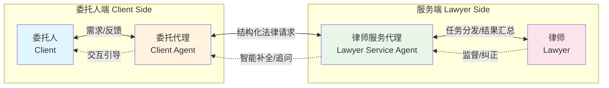
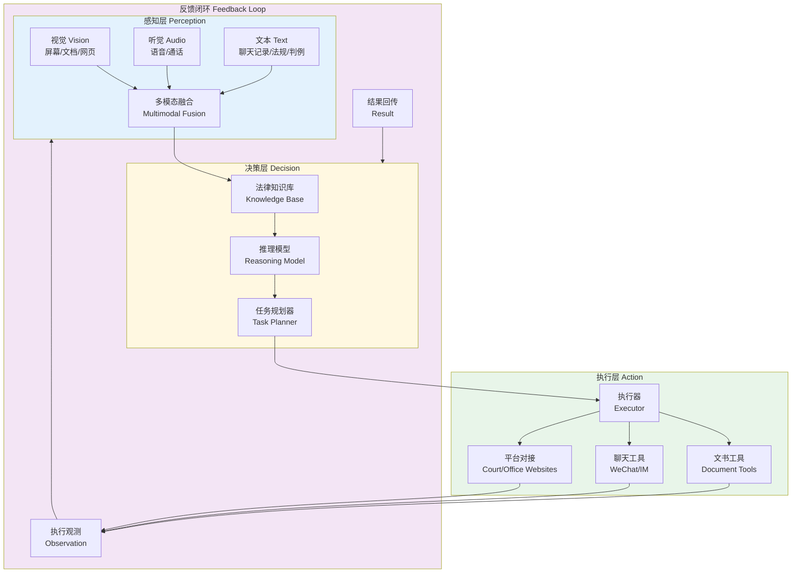
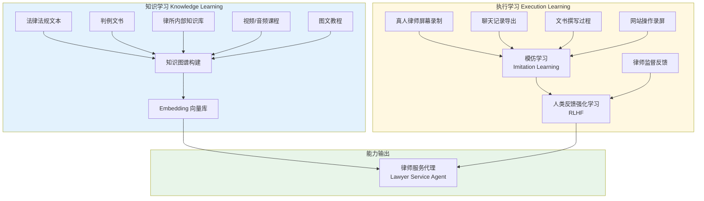
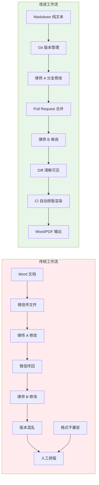
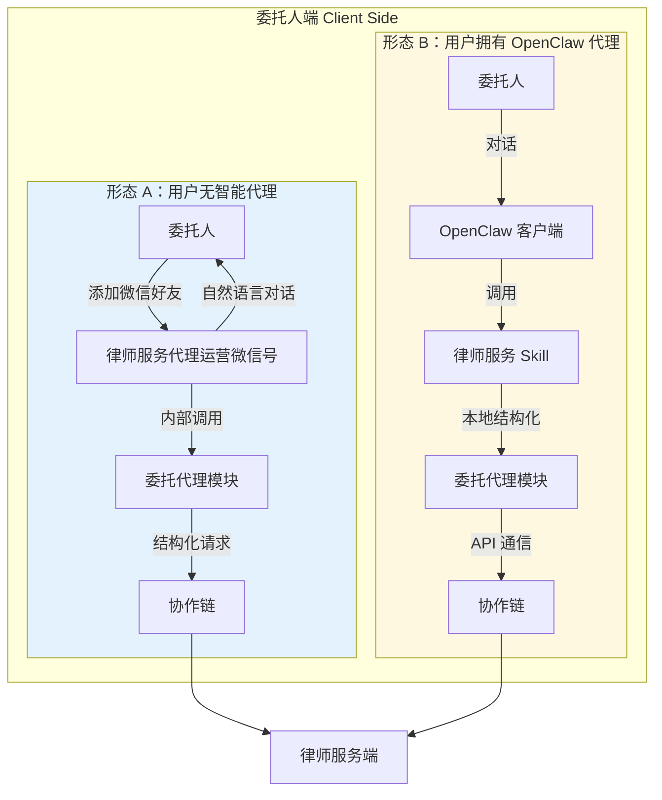
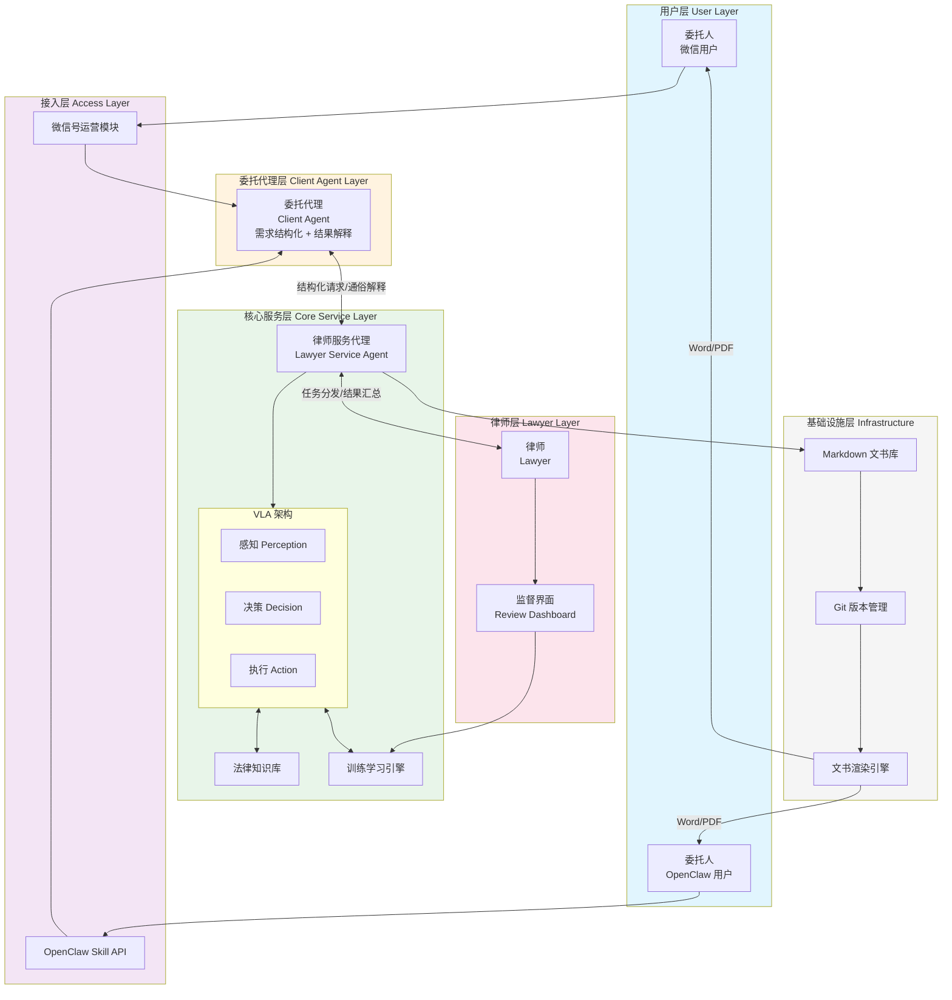
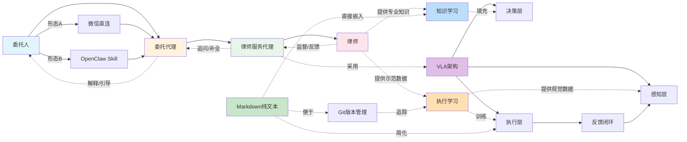

# 律师智能代理系统（Lawyer Agent System）

> 一个以 **委托人-委托代理-律师服务代理-律师** 四级协作链为核心，基于 VLA（Vision-Language-Action）架构的智能化法律服务生态系统。

---

## 一、核心协作链：四级智能体协同

整个系统的运转依赖于一条清晰的 **协作链（Collaboration Chain）**：

### 1.1 角色定义与联系

| 角色 | 职责 | 与其他角色的联系 |
|------|------|-----------------|
| **委托人 (Client)** | 提出法律需求、提供案件信息、确认方案、支付费用 | 通过委托代理降低沟通门槛；接收律师服务代理的反馈结果 |
| **委托代理 (Client Agent)** | 理解委托人自然语言需求 → 结构化法律请求；将专业法律语言翻译为通俗解释 | 向上衔接委托人，向下对接律师服务代理；是"需求翻译器"和"反馈解释器" |
| **律师服务代理 (Lawyer Service Agent)** | 接收结构化请求 → 基于法律知识库生成初步方案 → 调用工具执行任务（文书撰写、材料提交等）→ 汇总结果 | 核心枢纽：承接委托代理的输入，分发任务给律师或自动执行，双向反馈 |
| **律师 (Lawyer)** | 审核代理生成的方案、处理复杂/高风险事项、最终签字/出庭 | 对律师服务代理进行监督与纠错；代理的学习源和行为模板 |

> **联系强化**：委托代理与律师服务代理之间的接口是系统的"咽喉"——委托代理将**非结构化人类语言**转化为**结构化法律任务描述**，律师服务代理据此进行知识检索与动作规划。两者共同构成"智能缓冲层"，让委托人和律师都能以最低成本参与协作。

---

## 二、律师服务代理：VLA 终态架构

律师服务代理的终极形态采用 **VLA（Vision-Language-Action）架构**，即"视觉-语言-动作"三位一体模型，对应人类律师的"看-想-做"能力：

### 2.1 感知层（Perception）

律师服务代理的"感官系统"，负责接收多模态输入：

- **视觉（Vision）**：识别法院网站的表单结构、阅读扫描件/图片证据、解析 Word/PDF 文书的排版格式
- **听觉（Audio）**：处理语音咨询、电话会议录音、庭审录音
- **文本（Text）**：解析聊天记录、法律法规、合同文本、判例文书
- **多模态融合**：将上述信息整合为统一的情境表示（situation representation），供决策层使用

> **与训练体系的联系**：感知层的性能直接取决于**知识学习阶段**输入的多模态数据质量（见第三章）。数据越丰富，代理对真实法律场景的理解越准确。

### 2.2 决策层（Decision）

律师服务代理的"大脑"，负责理解、推理与规划：

- **法律知识库**：存储法律法规、判例、律所内部知识、文书模板等
- **推理模型**：基于大语言模型（LLM）或专业法律模型，进行法律分析、类案检索、风险评估
- **任务规划器**：将复杂法律任务拆解为可执行的子任务序列（如：接案 → 材料整理 → 文书起草 → 律师审核 → 提交法院）

> **与律师角色的联系**：决策层的初始策略来源于对**真人律师行为的学习**（模仿学习）。律师不仅提供知识，还提供"决策风格"和"风险偏好"，代理在律师监督下持续对齐。

### 2.3 执行层（Action）

律师服务代理的"双手"，负责与外部工具和环境交互：

- **文书工具**：撰写、排版、格式化法律文书（起诉状、答辩状、律师函等）
- **聊天工具**：操作微信等 IM 工具与客户进行沟通
- **平台对接**：登录法院网站、电子诉讼平台、工商查询系统等，自动提交材料、查询进度

> **与提效改进点的联系**：执行层的文书生成若采用 **Markdown 纯文本格式**（见第四章），将大幅降低版本管理成本，使代理生成的文书与律所现有工作流无缝衔接。

### 2.4 反馈闭环（Feedback Loop）

执行动作的结果会被重新输入感知层，形成**观察-决策-执行-观察**的闭环：

- 提交法院后，代理观测页面反馈（成功/失败/待补充材料）
- 客户在微信上的回复，代理重新感知并进入下一轮决策
- 律师对文书的修改意见，作为监督信号优化决策层

> **与协作链的联系**：反馈闭环使律师服务代理成为协作链中的"自主节点"——它不仅能被动接收指令，还能主动发现问题、追问委托人、请求律师介入，实现**半自治运转**。

---

## 三、训练-学习体系：从新手到专家

律师服务代理的能力并非预设，而是通过一个双轨制训练体系逐步获得：

### 3.1 知识学习（Knowledge Learning）

**目标**：构建代理的法律"常识库"和"专业知识库"。

- **输入**：
  - 法律法规、司法解释、部门规章等**规范性文本**
  - 海量判例文书（判决书、裁定书、调解书）
  - 律所内部积累的知识库、办案手册、文书模板
  - 法律培训**视频/音频**、专家讲座
  - 图文教程、流程图解

- **处理**：
  - 文本类：分块 → 向量化 → 存入向量数据库（RAG 检索增强生成）
  - 视频/音频：语音识别（ASR）→ 文本提取 → 关键帧抽取
  - 结构化知识：构建法律知识图谱（实体：当事人、案由、法条；关系：适用、引用、冲突）

- **与 VLA 的联系**：知识学习的输出直接填充 **决策层的法律知识库**，是代理进行法律推理的"燃料"。

### 3.2 执行学习（Execution Learning）

**目标**：让代理学会"像律师一样操作电脑和工具"。

- **输入**：
  - 真人律师**屏幕录制**（操作法院网站、使用 Word、排版文书）
  - **聊天记录导出**（微信、企业微信与客户沟通的完整上下文）
  - 文书撰写过程（从空白文档到终稿的完整编辑历史）
  - 网站操作录屏（登录、填表、上传、提交）

- **学习方式**：
  - **模仿学习（Imitation Learning）**：代理观察律师在特定情境下的行为序列（状态 → 动作 → 下一状态），学习策略函数 π(a\|s)
  - **人类反馈强化学习（RLHF）**：律师对代理的执行结果进行评分/修正，代理根据反馈优化行为策略

- **与 VLA 的联系**：执行学习的输出直接训练 **执行层的执行器（Executor）**，使其掌握工具使用技能。同时，执行过程中的屏幕画面也是 **感知层视觉模块** 的训练数据。

> **关键联系**：知识学习解决"知道什么是对的"，执行学习解决"知道怎么把它做出来"。两者共同构成代理的完整能力。真人律师在训练阶段是"老师"，在运行阶段是"监督者"——这种双重角色设计确保了代理的能力边界始终与人类专家对齐。

---

## 四、提效改进点：Markdown 纯文本工作流

为了让律师服务代理无缝融入律师事务所的现有工作流，建议在律所内部推行 **Markdown 纯文本格式**作为文书的"源码"：

### 4.1 为什么选 Markdown？

| 维度 | Word 文档 | Markdown 纯文本 |
|------|-----------|-----------------|
| **版本管理** | 二进制格式，Git 无法 diff | 纯文本，Git 完美追踪每一行修改 |
| **代理生成** | 需操作复杂 COM 接口 / 模拟鼠标 | 直接文本输出，结构化、确定性高 |
| **协作审阅** | 传文件、改格式、版本混乱 | 分支管理、PR 审阅、冲突可解决 |
| **排版输出** | 手动调整字体、间距、页眉页脚 | Markdown → LaTeX/Pandoc → 标准文书格式 |
| **知识复用** | 内容 locked 在文件中 | 文本片段可直接嵌入知识库、模板库 |

### 4.2 与系统其他部分的联系

- **与训练体系**：Markdown 作为纯文本，极大简化了**知识学习**中的文本抽取和**执行学习**中的动作空间（代理只需生成文本，无需操作复杂排版软件）。
- **与 VLA 执行层**：代理在执行文书任务时，先生成 Markdown "源码"，再通过自动化工具渲染为标准法律文书，降低执行复杂度。
- **与律师角色**：律师可以像审阅代码一样审阅 Markdown 文书，使用熟悉的 diff 工具提出修改意见，提升人-代理协作效率。

---

## 五、委托人代理：两种接入形态

委托人（客户）侧的智能代理根据用户的技术能力，提供两种接入方式：

### 5.1 形态 A：用户无智能代理（微信直连）

**场景**：普通法律消费者，不熟悉 AI 工具，只想像平常一样通过微信找律师。

**流程**：
1. 委托人添加律师服务代理运营的**微信号**
2. 像与真人律师对话一样，发送文字、语音、图片描述案情
3. 代理背后的**委托代理模块**自动运行，将自然语言转化为结构化法律请求
4. 后续流程进入核心协作链，律师服务代理处理并反馈

**优势**：零门槛，符合现有用户习惯
**联系**：此形态下的"委托代理"是**律师服务端的能力**，对用户透明。用户感受到的是一个"很聪明的律师助理微信"。

### 5.2 形态 B：用户拥有 OpenClaw 代理（Skill 模式）

**场景**：技术型用户，已使用 OpenClaw 等个人智能代理框架，希望将法律服务能力集成到自己的代理中。

**流程**：
1. 用户在 OpenClaw 中安装**律师服务 Skill**
2. 用户与自己的 OpenClaw 对话，表达法律需求
3. OpenClaw 调用 Skill，Skill 内置的**委托代理模块**在本地完成需求结构化
4. 通过 API 与律师服务端的协作链通信，获取服务结果
5. 结果返回用户 OpenClaw，由其整合进用户的个人工作流

**优势**：
- 用户侧代理可跨服务整合（法律需求可与日程管理、文档管理联动）
- 通信更结构化，减少信息损耗
- 支持批量、自动化法律任务（如企业用户批量合同审查）

**联系**：此形态下，委托代理**分布在用户侧和服务侧**，协作链的入口前移。OpenClaw 成为委托人的"数字分身"，它理解用户的完整上下文（不仅是本次对话），能提出更精准的法律需求。

### 5.3 两种形态的对比与联系

| 维度 | 形态 A：微信直连 | 形态 B：OpenClaw Skill |
|------|----------------|------------------------|
| **用户门槛** | 极低（会用微信即可） | 中等（需安装配置 OpenClaw）|
| **委托代理位置** | 服务端（透明） | 用户侧 + 服务端 |
| **上下文理解** | 单会话上下文 | 跨会话、跨 Skill 的全局上下文 |
| **适用人群** | C 端个人消费者 | B 端企业用户、技术型个人 |
| **与协作链关系** | 标准入口 | 增强入口（ richer context ）|
| **数据流** | 微信消息 → 委托代理 → 律师服务代理 | OpenClaw → Skill → 委托代理 → API → 律师服务代理 |

> **统一性**：无论哪种形态，最终都汇入同一套 **协作链** 和 **VLA 律师服务代理**。两种形态是"前端接口"的差异，后端核心能力复用。随着用户 AI 素养提升，形态 A 的用户可能向形态 B 迁移，实现更深度的人-代理协作。

---

## 六、系统全景架构

---

## 七、概念联系总览

为了更清晰地展示本文档中各概念如何相互支撑，以下是一张**概念依赖关系图**：

### 7.1 联系矩阵

| 概念 | 与「协作链」的联系 | 与「VLA架构」的联系 | 与「训练学习」的联系 | 与「Markdown」的联系 | 与「委托人代理」的联系 |
|------|-------------------|---------------------|----------------------|----------------------|------------------------|
| **协作链** | — | VLA 是律师服务代理的实现内核 | 训练使代理有能力参与链式协作 | Markdown 是链上文书传输的标准格式 | 委托人代理是协作链的入口前端 |
| **VLA架构** | 提供律师服务代理的技术骨架 | — | 知识学习→决策层；执行学习→执行层 | 执行层输出 Markdown 降低复杂度 | 感知层接收委托人代理的输入 |
| **训练学习** | 让代理达到参与协作链的能力阈值 | 直接塑造 VLA 的决策与执行能力 | — | Markdown 简化训练数据格式 | 委托人代理的行为也可被学习 |
| **Markdown** | 使链上文书可版本追踪、可 diff | 缩小执行层动作空间，提升可靠性 | 纯文本便于知识抽取和过程记录 | — | 两种委托人代理形态均可输出 Markdown |
| **委托人代理** | 是协作链的委托侧起点 | 其输出是 VLA 感知层的输入 | 可通过分析其对话记录优化意图理解 | 技术型代理可直接生成 Markdown | — |

---

## 八、总结

本系统通过以下设计实现法律服务的智能化升级：

1. **四级协作链**（委托人 → 委托代理 → 律师服务代理 → 律师）实现人机分层协作，让每个人/代理做最适合的事。
2. **VLA 终态架构**赋予律师服务代理类人的"看-想-做"能力，使其成为半自治的智能体。
3. **双轨训练体系**（知识学习 + 执行学习）确保代理既有法律专业知识，又有实际操作技能。
4. **Markdown 纯文本工作流**从基础设施层面降低代理生成与人工协作的成本。
5. **两种委托人代理形态**兼顾零门槛普及与技术深度集成，覆盖全量用户群体。

> 最终愿景：**让每一位委托人都能以最低成本获得可信赖的智能法律服务，让每一位律师都能将精力聚焦于最需要人类智慧的高价值环节。**
